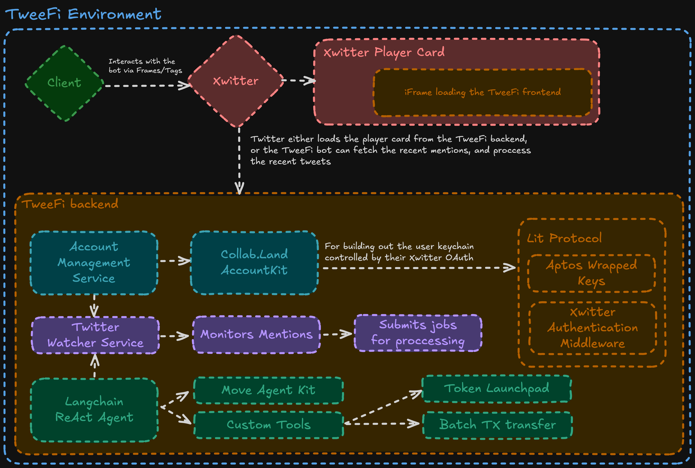

# TweeFi: Invisible On-Chain Transactions via Social AI

<div align="center">
  
  <br>
  <h3>Making Web3 as easy as tweeting</h3>
</div>

## 🚀 Introduction

TweeFi (@tweefi) is an **AI-powered on-chain agent** that enables **seamless crypto tipping, fair token launches, and DeFi operations—all from within Twitter (X)**.

With TweeFi, users don't need to **set up wallets, manage private keys, or understand gas fees**. They simply **tag @tweefi and issue natural language commands**, and the bot securely executes transactions on their behalf.

By leveraging **MPC-based smart accounts, Move Agent Kit, and NLP-powered AI**, TweeFi transforms **social interactions into financial transactions**, making Web3 **accessible to anyone**.

## 🎬 Demo

Check out our demo video: [TweeFi Demo on YouTube](https://youtu.be/hxG-diHzMBk)

## 🏗️ Architecture

<div align="center">
  
</div>

## 💡 What We're Building

TweeFi makes **on-chain finance invisible yet powerful** by integrating **Lit Protocol, Move Agent Kit, and AI-driven intent resolution**.

### Core Features

#### ✅ Seamless Tipping
- Users can tip in **APT, stablecoins, or custom tokens** with a simple mention:
  - `@tweefi tip @alice 5 APT` → Instantly executed on-chain.

#### ✅ Instant Token Launches
- Anyone can launch a **fair token** in seconds:
  - `@tweefi create $MEME 1M supply` → Smart contract deployed.

#### ✅ More On-Chain Use Cases (Roadmap)
- On-chain **polls, DAO votes, swaps, staking, yield farming**—all via **natural language commands**.
- Gasless transactions via **Kana Labs Paymasters**.

### Why TweeFi is Unique

#### 🔹 No Wallets, No Hassle
- Users log in via **OAuth2 (Twitter, Discord, Telegram)**—MPC wallets are **invisible**.

#### 🔹 Secure AI-Driven Execution
- Natural language commands are processed by an **NLP engine**, resolved into **Move Agent Kit transactions**, and signed via **TEE-secured Lit Protocol accounts**.

#### 🔹 Bridges Social & DeFi
- Converts **likes, comments, and social interactions into financial actions**.

## 🛠 Technology Stack

### Core Architecture

- **MPC-Based Smart Accounts** → Secure, gasless transactions.
- **Move Agent Kit** → AI-powered transaction execution.
- **Lit Protocol** → Trusted Execution Environment (TEE) for secure key management.
- **Kana Labs Paymasters** → Gasless, frictionless transactions.
- **NLP Intent Resolution** → AI understands & executes user commands.

### How It Works

1. **User Tags @tweefi & Sends a Command**
   - Example: `@tweefi tip @bob 10 APT`

2. **TweeFi AI Interprets Intent & Generates Transaction**
   - NLP converts natural language → Move smart contract execution.

3. **Secure Execution via MPC Wallet**
   - Transaction signed & executed via **Lit Protocol's TEE**.

4. **Transaction Confirmation & Social Engagement**
   - A reply confirms execution:
     - `"@alice just received 5 APT from @bob via TweeFi!"`

## 🔧 Getting Started

### Prerequisites
- Node.js >= 22
- pnpm >= 9.14.1

### Installation

1. Clone the repository
```bash
git clone https://github.com/yourusername/TweeFi.git
cd TweeFi
```

2. Install dependencies
```bash
pnpm install
```

3. Set up environment variables
```bash
cp .env.example .env
# Edit .env with your credentials
```

4. Run the development servers
```bash
pnpm run dev
```

### Setting Up Twitter Authentication

1. Log in to Twitter with the development account
```bash
pnpm run login-x
```

2. Create the tunnel for development
```bash
pnpm run tunnel
```

## 📂 Project Structure

```
.
├── 📦 client/                 # Next.js frontend
│   ├── 📱 app/               # Next.js app router (pages, layouts)
│   ├── 🧩 components/        # React components
│   └── 💅 styles/           # Global styles and Tailwind config
│
├── ⚙️ server/               # Express.js backend
│   ├── 📂 src/             # Server source code
│   │   ├── 🛣️ routes/     # API route handlers
│   │   ├── 🧠 services/   # Core services (Twitter, Aptos, etc.)
│   │   └── 🛠️ tools/      # Tools and utilities
│   └── 🔧 bin/            # Server scripts
│
├── 📦 lit-actions/        # Lit Protocol actions
│   ├── 📂 src/            # Source code for Lit Actions
│   └── 🔍 actions/        # Compiled Lit Actions
│
└── 📝 assets/             # Project assets and diagrams
```

## 🌍 Impact & Adoption Potential

- 🚀 **Mainstream Web3 Adoption**: Removes complexity—**anyone can use crypto via Twitter**.
- 💰 **Creator Economy Revolution**: Tips, payments, and micro-transactions **without platforms taking cuts**.
- ⚡ **DeFi for Everyone**: Swaps, staking, and investing—**executed through a simple tweet**.
- 🔥 **Viral Social Finance**: Makes **blockchain engagement as easy as posting a status update**.

## 🚀 Roadmap

### 🔹 MVP (Current Release)
- ✅ Twitter Tipping (`@tweefi tip @user X tokens`)
- ✅ Token Launch (`@tweefi create $TOKEN X supply`)
- ✅ Secure MPC Smart Wallets (OAuth2-based)

### 🔹 Future Development
- ⚡ Expand to **Discord & Telegram** (multi-platform login).
- ⚡ Support **on-chain DAO votes, staking, swaps**.
- ⚡ Add **AI-driven portfolio management** & **DeFi integrations**.

## 🎯 Why TweeFi Will Win

- 🔥 **Viral by Design** → Twitter-native, frictionless adoption.
- 🚀 **Solves Real Problems** → Simplifies Web3 access **without wallets or gas fees**.
- 💡 **Leverages Cutting-Edge Tech** → **AI + Move + MPC wallets = Gamechanger**.
- 💰 **Monetization Ready** → Native **fee models, premium DeFi tools, & creator tips**.

## 🎯 Final Thoughts

TweeFi is **not just a hackathon project—it's the future of on-chain social finance**.

🚀 **Web3 should be as easy as tweeting**—and with TweeFi, it finally is.

Let's make **TweeFi the next big thing in Web3 adoption.**

## 🔗 Team & Contact

- **Project Name:** TweeFi (@tweefi)
- **Tech Stack:** Lit Protocol, Move Agent Kit, Kana Labs, NLP, OAuth2
- **Contact:** [Email](mailto:team@tweefi.xyz) | [Twitter](https://twitter.com/tweefi)

## 📜 License

This project is licensed under the MIT License - see the LICENSE file for details.